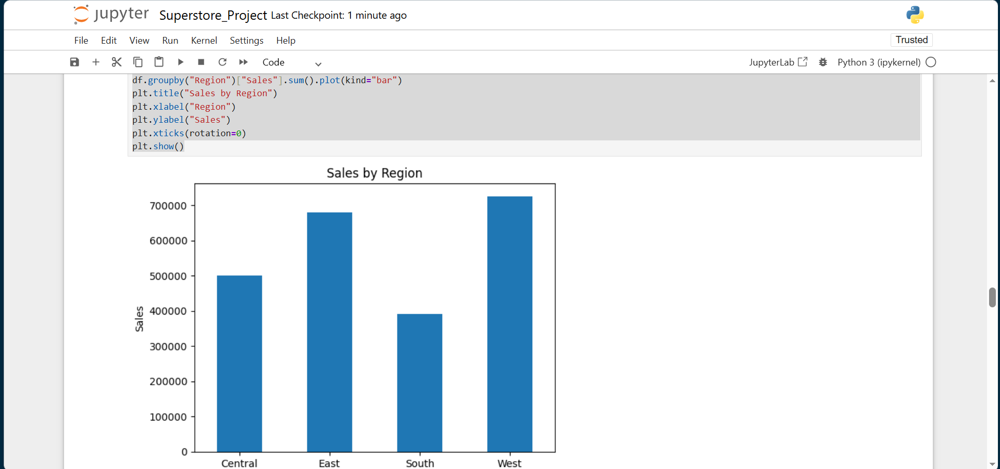
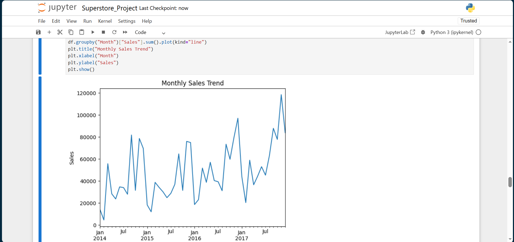
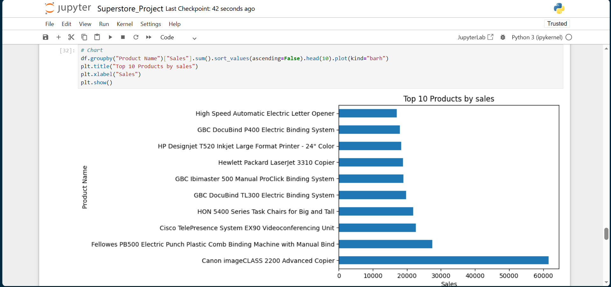
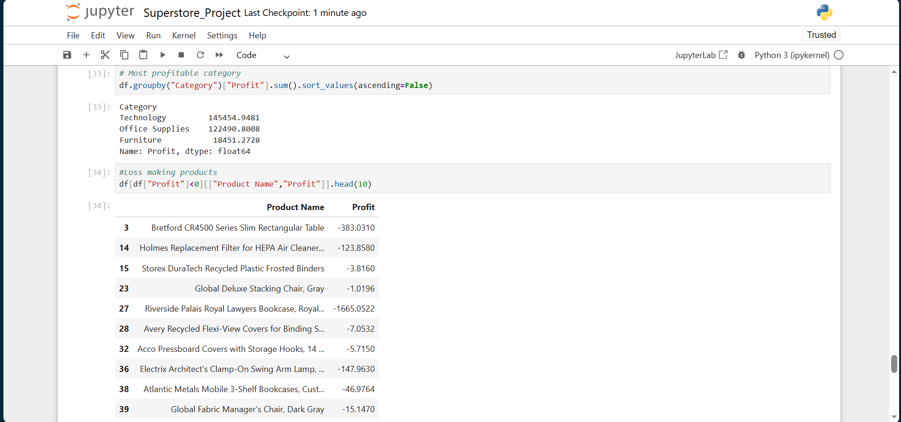

# Retail Sales Performance Analysis

## Project Overview
This project analyzes retail sales data to uncover trends, profitability drivers, regional performance, and product opportunities.

## Tools Used
- Python
- Pandas
- NumPy
- Matplotlib
- Jupyter Notebook

## Key Analysis Performed
- Data cleaning
- Missing value checks
- Duplicate checks
- Date conversion
- Exploratory data analysis
- Sales trend analysis
- Regional performance analysis
- Profitability analysis
- Product performance analysis
- Statistical Analysis
- Sales segmentation using NumPy

## Visualizations

### Sales by Region

### Monthly Sales Trend

### Top Products

### Category Profit

## Key Insights
- West region generated the highest sales.
- Technology category delivered the strongest profit.
- Sales fluctuated seasonally across months.
- Some products produced negative margins.

## Recommendations
- Increase stock before peak periods.
- Focus on profitable categories.
- Improve underperforming regions with product promotions.
- Reprice low-margin products.

## Files Included
- Retail_Sales_Performance_Analysis.ipynb [Python]
- Superstore.csv [Excel]
